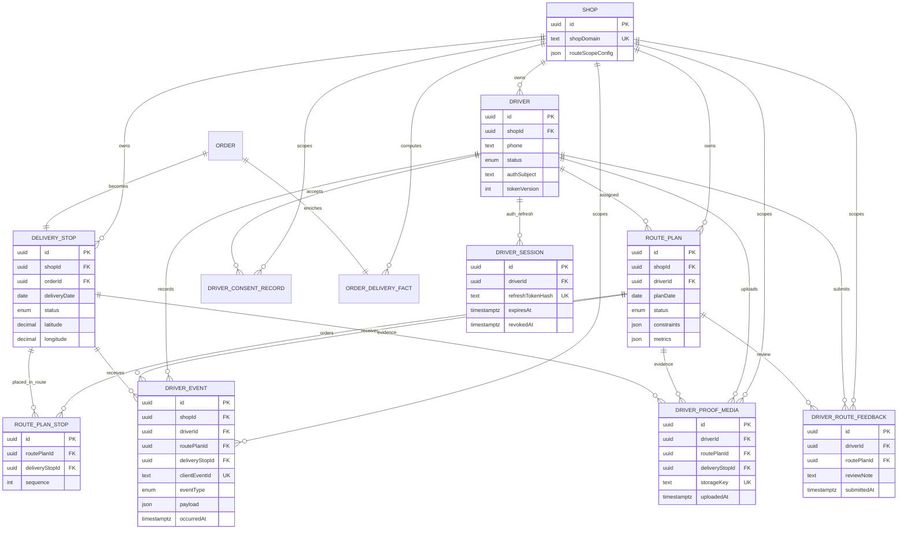
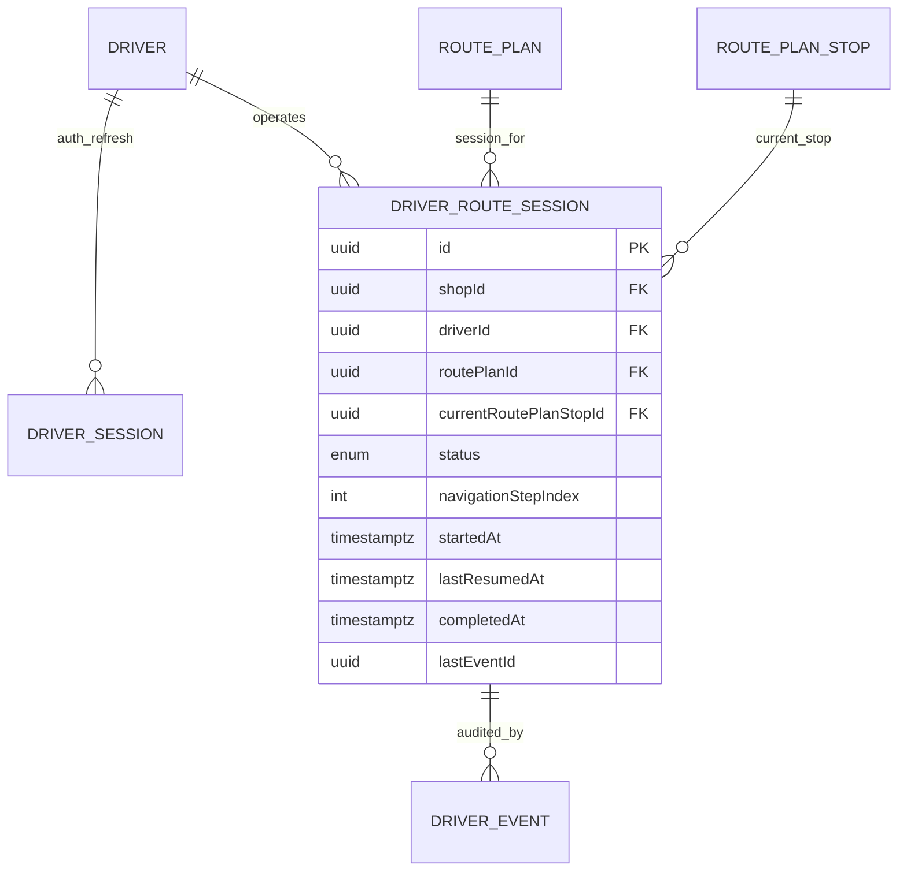

# Driver route session restore ERD review

Issue: [#80](https://github.com/EVNSolution/clever-route-server/issues/80)

## Goal

Define the server-side data/API shape needed for the driver app to restore an
in-progress route session after app restart, reinstall-adjacent login recovery,
or token refresh. This is a design slice only: no production deployment and no
schema migration is required by this branch.

## Current behavior summary

The driver app currently treats an active delivery session as app-local state:

1. The app loads assigned routes from `POST /driver/route-access/lookup`,
   `POST /driver/consents`, then `GET /driver/assigned-route`.
2. `Start Session` records a `ROUTE_STARTED` driver event when possible.
3. The app stores `activeRouteSession` locally with `routePlanId` and
   `navigationStepIndex`.
4. `Continue Session` opens the in-memory route session. Server state is not
   asked which route is active or where the driver should resume.

The server has `driver_sessions`, but that table is an auth refresh-token table,
not an operational delivery session table.

## Current ERD: driver route and session-adjacent tables



## Relationship findings

### What is normalized well

- `RoutePlanStop` is the correct ordered join between a planned route and a
  `DeliveryStop`. This prevents stop order from being copied onto every stop.
- Driver evidence tables (`DriverEvent`, `DriverProofMedia`,
  `DriverRouteFeedback`) keep audit/evidence records separate from the route
  plan itself.
- `DriverSession` is cleanly scoped to authentication refresh sessions and does
  not mix auth state with route progress.
- `OrderDeliveryFact` is already an explicit computed/readiness fact table,
  which keeps commerce-source parsing separate from route execution.

### Where the graph is becoming hard to reason about

- The word `session` is overloaded. `DriverSession` means auth refresh session,
  while the driver app needs an operational route session.
- Active route state is split across at least three places:
  - `RoutePlan.status`
  - append-only `DriverEvent` rows
  - app-local `activeRouteSession`
- `ROUTE_STARTED` currently validates and records an event, but the event
  transition code only updates stop terminal states and route completion. It does
  not promote `RoutePlan.status` to `IN_PROGRESS`.
- `GET /driver/routes?status=active` maps active routes from
  `RoutePlan.status = IN_PROGRESS`. If `ROUTE_STARTED` does not set that status,
  route history can disagree with the app's local active session.
- The server does not store `navigationStepIndex`, current pickup/stop step, or
  current route-plan stop. This means the server cannot reconstruct the exact
  app session position from the schema after local state is gone.
- Several mobile-facing route details are stored in `RoutePlan.constraints` JSON
  (`companyDisplayName`, `timezone`, support copy) rather than normalized route
  metadata. That is tolerable for compatibility but should not become the only
  source of session state.

## Normalization vs. purposeful denormalization

### Avoid: renaming or repurposing `DriverSession`

`DriverSession` should remain an auth table. Repurposing it for active delivery
state would mix token revocation/expiry concerns with route progress and would
make both domains harder to maintain.

### Avoid: deriving all active-session state only from `DriverEvent`

An event-only model is normalized and auditable, but a restore endpoint would
need to scan and interpret ordered events for every app open. More importantly,
current app semantics include a pickup/company step and a `navigationStepIndex`
that are not fully represented by existing event types.

### Recommended: add a small denormalized operational read model

Introduce a route-session table as an operational projection, while keeping
`DriverEvent` as the audit trail.

Proposed table name: `DriverRouteSession` mapped to `driver_route_sessions`.
This avoids colliding with `DriverSession` auth semantics.

```prisma
model DriverRouteSession {
  id                     String                   @id @default(uuid()) @db.Uuid
  shopId                 String                   @db.Uuid
  shop                   Shop                     @relation(fields: [shopId], references: [id], onDelete: Cascade)
  driverId               String                   @db.Uuid
  driver                 Driver                   @relation(fields: [driverId], references: [id], onDelete: Cascade)
  routePlanId            String                   @db.Uuid
  routePlan              RoutePlan                @relation(fields: [routePlanId], references: [id], onDelete: Cascade)
  status                 DriverRouteSessionStatus @default(ACTIVE)
  currentRoutePlanStopId String?                  @db.Uuid
  currentRoutePlanStop   RoutePlanStop?           @relation(fields: [currentRoutePlanStopId], references: [id], onDelete: SetNull)
  navigationStepIndex    Int                      @default(0)
  startedAt              DateTime                 @db.Timestamptz(6)
  lastResumedAt          DateTime?                @db.Timestamptz(6)
  completedAt            DateTime?                @db.Timestamptz(6)
  lastEventId            String?                  @db.Uuid
  lastEvent              DriverEvent?             @relation(fields: [lastEventId], references: [id], onDelete: SetNull)
  createdAt              DateTime                 @default(now()) @db.Timestamptz(6)
  updatedAt              DateTime                 @updatedAt @db.Timestamptz(6)

  @@unique([driverId, routePlanId])
  @@index([shopId, driverId, status, updatedAt])
  @@index([shopId, routePlanId, status])
  @@map("driver_route_sessions")
}

enum DriverRouteSessionStatus {
  ACTIVE
  PAUSED
  COMPLETED
  ABANDONED
}
```

Notes:

- PostgreSQL should eventually enforce one active route per driver with a partial
  unique index such as `(driver_id) WHERE status IN ('ACTIVE', 'PAUSED')`.
  Prisma schema cannot express this fully, so it should live in the SQL
  migration and be documented in tests.
- `navigationStepIndex` is denormalized on purpose because the mobile UX already
  uses that index. `currentRoutePlanStopId` gives the server a relational anchor
  when the current step points to a stop.
- `lastEventId` links the projection back to the append-only audit trail without
  making events the only source of restore truth.

## Target ERD with operational route session



## Restore API proposal

### GET `/driver/route-session/active`

Purpose: after token restore or login, let the app ask the server whether the
authenticated driver has an operational route session to continue.

Request:

- Auth: existing driver bearer token.
- Query: none for the default active session. A future `routePlanId` query can
  support explicit route selection.

Response when active:

```json
{
  "data": {
    "status": "ACTIVE_SESSION",
    "session": {
      "sessionId": "uuid",
      "routePlanId": "uuid",
      "status": "ACTIVE",
      "navigationStepIndex": 2,
      "currentRoutePlanStopId": "uuid-or-null",
      "currentDeliveryStopId": "uuid-or-null",
      "startedAt": "2026-06-15T12:00:00.000Z",
      "lastResumedAt": "2026-06-15T12:20:00.000Z",
      "lastEventId": "uuid-or-null"
    },
    "route": {
      "...": "same shape as GET /driver/assigned-route route"
    }
  },
  "error": null
}
```

Response when none:

```json
{
  "data": { "status": "NO_ACTIVE_SESSION" },
  "error": null
}
```

Behavior:

- Scope by authenticated `driverId` and `shopDomain` from the bearer token.
- Return only sessions whose route plan is still assigned to the driver and not
  cancelled.
- Include the assigned route payload so the app can open the session directly
  without a second assigned-route call.
- Set `lastResumedAt` on successful restore if write access is acceptable for a
  GET alternative. If strict read-only GET is preferred, use
  `POST /driver/route-session/active/resume` for this timestamp.

### POST `/driver/route-sessions/:routePlanId/start`

Purpose: replace app-local start semantics with an idempotent server start.

Behavior:

- Authenticated driver must own the route plan.
- Create or reactivate `DriverRouteSession` for `(driverId, routePlanId)`.
- Record or reuse `ROUTE_STARTED` with app-supplied `clientEventId` for
  idempotency.
- Promote `RoutePlan.status` to `IN_PROGRESS` if current status is
  `OPTIMIZED` or `ASSIGNED`.
- Return the same session envelope as restore.

### PATCH `/driver/route-sessions/:sessionId/progress`

Purpose: persist the pickup/current-stop pointer that the app currently stores
as `navigationStepIndex`.

Payload:

```json
{
  "navigationStepIndex": 2,
  "currentRoutePlanStopId": "uuid-or-null",
  "clientEventId": "optional-idempotency-key",
  "occurredAt": "2026-06-15T12:30:00.000Z"
}
```

Behavior:

- Validate the route-plan stop belongs to the session route.
- Keep `navigationStepIndex` inside `[0, routeStopCount]`.
- Optionally record a `NOTE_ADDED`/future `ROUTE_STEP_ADVANCED` event.

### Existing APIs to keep

- Keep `GET /driver/assigned-route` for read-only route preview/details.
- Keep `POST /driver/events` for auditable delivery events and offline retry.
- Keep `/driver/auth/refresh` as auth only.

## Minimal no-migration bridge

If a schema migration is blocked, a temporary `GET /driver/route-session/active`
can derive a weaker restore candidate from existing tables:

1. Find driver's `RoutePlan` rows in `IN_PROGRESS`, or rows with a latest
   `ROUTE_STARTED` event and no later `ROUTE_COMPLETED` event.
2. Choose the newest started route by `DriverEvent.occurredAt`.
3. Compute completed/failed stops from `DeliveryStop.status` through
   `RoutePlanStop`.
4. Return `navigationStepIndex` as:
   - `0` if no terminal stop events exist,
   - otherwise the next incomplete route-stop sequence.

Limitations:

- Cannot distinguish pickup completed from “still at company pickup”.
- Cannot restore an app-local session whose `ROUTE_STARTED` event remained in
  the app offline queue and never reached the server.
- Cannot enforce one active session per driver without either status promotion
  discipline or a projection table.

This bridge is acceptable only as a short-lived compatibility slice.

## Implementation slices

1. **Contract tests first**
   - Add route tests for `GET /driver/route-session/active`:
     active session, no active session, wrong driver scope, cancelled route,
     completed session.
2. **No-migration bridge**
   - Add a read-only repository method deriving active session from
     `RoutePlan.status` + `DriverEvent`.
   - Include assigned route shape in the response.
3. **Start transition hardening**
   - Update `ROUTE_STARTED` handling to promote owned route plans to
     `IN_PROGRESS`.
   - Keep idempotency through `clientEventId`.
4. **Projection table migration**
   - Add `DriverRouteSession` and partial active-driver uniqueness in SQL.
   - Update start/progress/completion events to maintain the projection.
5. **Driver app integration**
   - On token restore/login, call restore endpoint first.
   - If active, open route session using returned `navigationStepIndex`.
   - If none, keep current assigned route list flow.

## Risks and guardrails

- **Auth/session naming confusion:** never call the new table `DriverSession`.
- **Event/projection drift:** projection updates and event writes should happen
  in one transaction where possible.
- **Offline-first mismatch:** app may continue locally while event upload is
  queued; restore endpoint can only represent server-known progress.
- **Route reassignment:** if dispatch reassigns a route while a session is
  active, restore must reject or mark `ABANDONED` rather than leaking another
  driver's route.
- **Backwards compatibility:** existing driver app clients must continue to use
  assigned-route and driver-event APIs until the new restore contract is shipped.

## Recommendation

Implement the no-migration bridge first only if deployment pressure requires it,
but treat `DriverRouteSession` as the stable design. It is a purposeful
read-model denormalization: the audit trail remains normalized in `DriverEvent`,
while the mobile app gets a simple, scoped, idempotent restore API.


## Source anchors

- `apps/delivery-api/prisma/schema.prisma` — current `DriverSession`,
  `RoutePlan`, `RoutePlanStop`, `DeliveryStop`, `DriverEvent`, proof-media,
  consent, and feedback models.
- `apps/delivery-api/src/modules/driver/driver-auth.repository.ts` —
  `DriverSession` is created and refreshed as auth refresh-token state.
- `apps/delivery-api/src/modules/driver/driver-assigned-route.repository.ts` —
  assigned route reads are scoped by authenticated driver and route plan, but do
  not return active operational session progress.
- `apps/delivery-api/src/modules/driver/driver-event.repository.ts` — driver
  events validate route/stop scope and update stop/route completion, but do not
  currently promote `ROUTE_STARTED` to `RoutePlan.status = IN_PROGRESS`.
- `apps/delivery-api/src/modules/driver/driver-self-service.repository.ts` —
  route history maps active routes from `RoutePlan.status = IN_PROGRESS`.
- `apps/delivery-api/src/routes/driver-events.routes.ts` — existing mobile API
  surface for route access, assigned route, route history, profile, consents,
  events, proof media, and feedback.
